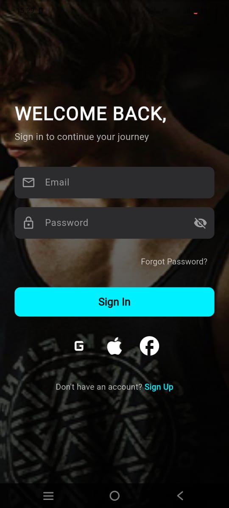
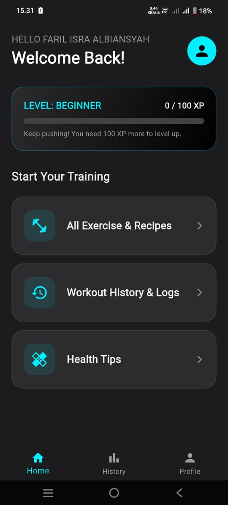
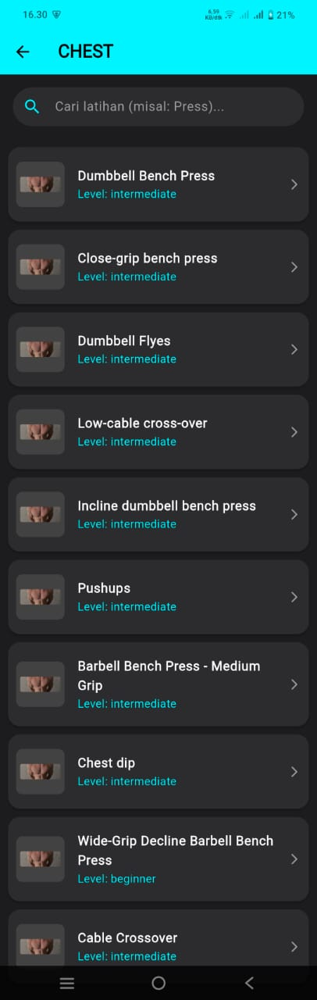
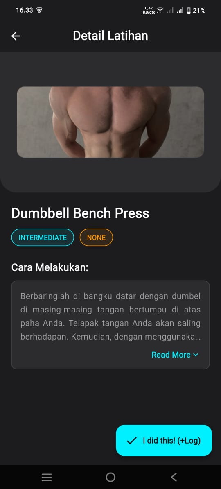
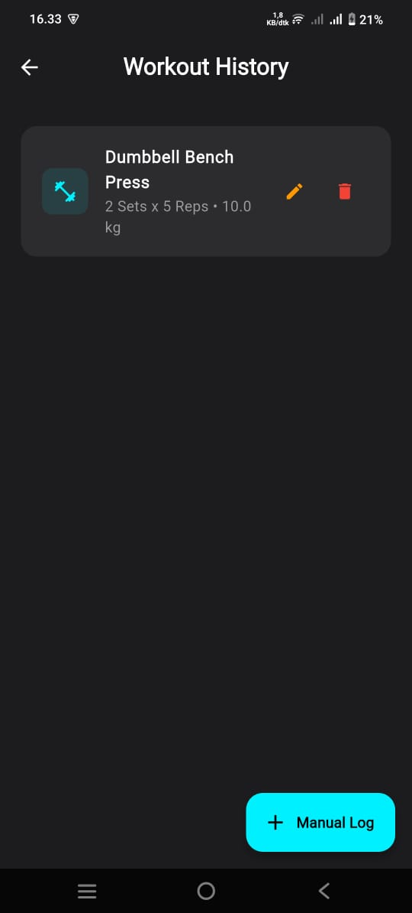
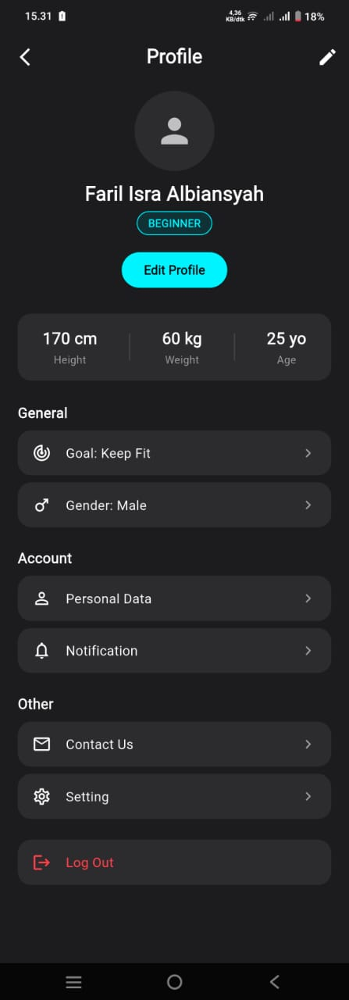

# 🏋️ GET FIT GYM


**GET FIT GYM** is a modern, dynamic fitness application designed to help beginners start their fitness journey. Built with Flutter, this app integrates **RESTful API (API Ninjas)** for real-time exercise data and **Firebase** for user management and data persistence.

> **Final Project (UAS) - Mobile Programming**
> * **Name:** Faril Isra Albiansyah
> * **NIM:** 240605110087
> * **University:** UIN Maulana Malik Ibrahim Malang

---

## 📱 Features

### 1. Authentication & Onboarding
* **Sign Up & Login:** Secure authentication using **Firebase Auth**.
* **Smart Onboarding:** A 7-step wizard to set up user profile (Gender, Age, Weight, Height, Experience Level, and Goal).
* **Auto-Login:** Remembers user session (Persistent Login).

### 2. Dashboard & Gamification (RPG Style) 🎮
* **Leveling System:** Users start as *Beginner*. Completing workouts grants **XP (Experience Points)**.
* **Dynamic Progress:** Visual XP bar on the dashboard that updates in real-time.
* **Rank Up:** Automatically promotes user to *Intermediate* or *Advance* when XP threshold is met.

### 3. Exercise Library (REST API) 🌐
* **API Integration:** Fetches thousands of exercises from **API Ninjas**.
* **Smart Search:** Features a search bar with a simulated loading state and asynchronous filtering.
* **Categorization:** Browse exercises by muscle groups (Chest, Back, Legs, etc.) with smart mapping logic.
* **Details:** View detailed instructions, equipment needed, and target muscles.

### 4. Workout Logger (CRUD) 📝
* **Create:** Log workouts directly from the detail page or manually.
* **Read:** View workout history sorted by date.
* **Update:** Edit logs (Change weight, sets, or reps).
* **Delete:** Remove unwanted logs.
* **Reward:** Every log entry grants **+20 XP**.

### 5. Profile Management
* **Editable Profile:** Users can update their stats (Weight, Height, Goal) via a modern bottom sheet.
* **Real-time Sync:** All changes are immediately saved to **Cloud Firestore**.

---

## 📸 Screenshots

| Login & Register | Home & Leveling | Exercise List |
|:---:|:---:|:---:|
|  |  |  |

| Detail & Search | Workout Log (CRUD) | Profile & Edit |
|:---:|:---:|:---:|
|  |  |  |

*(Note: Replace `screenshots/filename.png` with your actual image paths)*

---

## 🛠️ Tech Stack

* **Framework:** Flutter (Dart)
* **Architecture:** MVC (Model-View-Controller)
* **State Management:** GetX
* **Backend:** Firebase (Authentication & Cloud Firestore)
* **External API:** API Ninjas (Fitness Exercises)
* **HTTP Client:** `http` package
* **UI Kit:** Google Fonts, Custom Widgets, Dark Mode Theme

---

## 🚀 How to Run

1.  **Clone the repository**
    ```bash
    git clone [https://github.com/username/get-fit-gym.git](https://github.com/username/get-fit-gym.git)
    ```

2.  **Install Dependencies**
    ```bash
    flutter pub get
    ```

3.  **Firebase Setup (Crucial!)**
    * This app uses Firebase. You must provide your own `google-services.json`.
    * Place your `google-services.json` file inside `android/app/`.

4.  **Run the App**
    ```bash
    flutter run
    ```

---

## 📂 Project Structure
